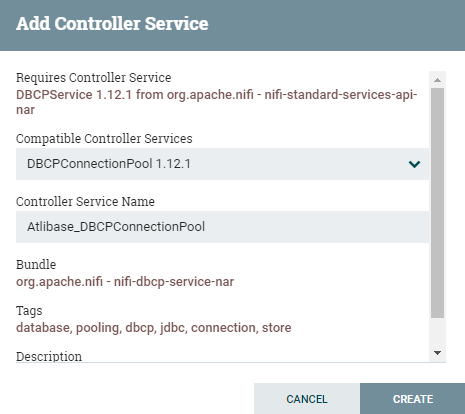

# How to Use Altibase in NiFi

1. Copy Altibase JDBC driver in $NIFI_HOME/lib directory.

   - Altibase 7.1

     Use $ALTIBASE_HOME/lib/Altibase42.jar. (From Altibase 7.1.0.5.6, JDBC driver that partially supports JDBC API Specification 4.2 is provided additionally)

   - Altibase 7.2

     Use $ALTIBASE_HOME/lib/Altibase.jar.

2. Restart NiFi to apply the JDBC driver.

3. Create Altibase connection pool via NiFi's controller service. 

   Controller service can be registered using the processor's properties which are applicable. The registered contoller service can be used by other processors when chosen.

   Below is an example registering Altibase's controller service by registering one of GenerateTableFetch Processor's properties, Database Connection Pooling Service.

   3.1 Click 'Create new service...'

   

   3.2 Specify 'Controller Service Name' and click 'CREATE'.

   

   3.3 Click the arrow created on the third column after creating it.

   3.4 Click the gear icon to specify the properties of the controller service.

   3.5 Click 'PROPERTIES' tab, insert the following values and click 'APPLY' to connect to Altibase DB.

   - Database Connection URL: jdbc:Altibase://***host_ip:port_no/database_name***

     - To process CLOB larger than 32KB, set the force_clob_bind=true option.

       jdbc:Altibase://*host_ip:port_no/database_name*?**force_clob_bind=true**

   - Database Driver Class Name: Altibase.jdbc.driver.AltibaseDriver

   - Database Driver Location: The directory Altibase JDBC driver exists.

   - Database User: User account

   - Password: User password

     

     3.6 By clicking 'APPLY', it returns to the controller service list. Click the thunder icon to enable controller service.