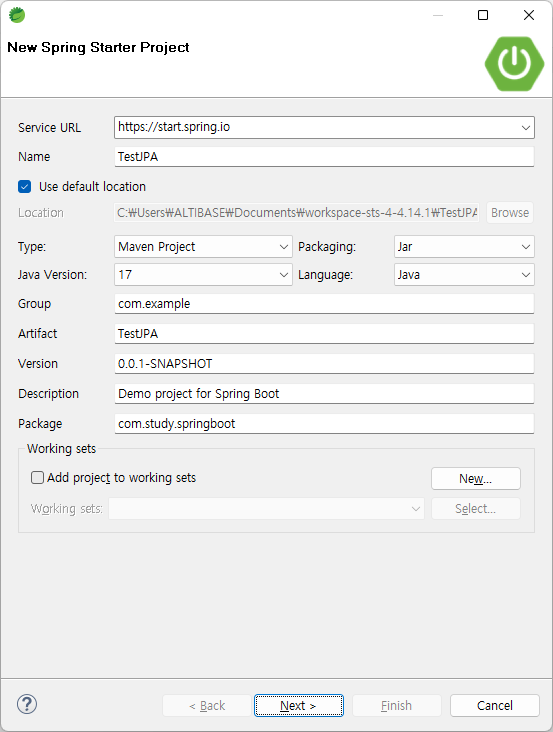

# Create Spring Data JPA Project with Spring Boot

#### 1. Create Spring Boot Project

Click File -> New -> Spring Starter Project and fill in the project information such as name, group and package. Then, click Next.

#### 2. Add Spring Starter Project Dependencies

Spring Starter Project Dependencies is a set of essential libraries required to use certain features in Spring Boot. Select Spring Data JPA and add Lombok to write the sample code easier.

#### 3. Click Finish

When Finish button is clicked, Progress is enabled and relevant libraries are downloaded. After creating the project, the user can see the dependency libraries are added in build information file. The image below shows an example of Maven type's project, pom.xml.

 

