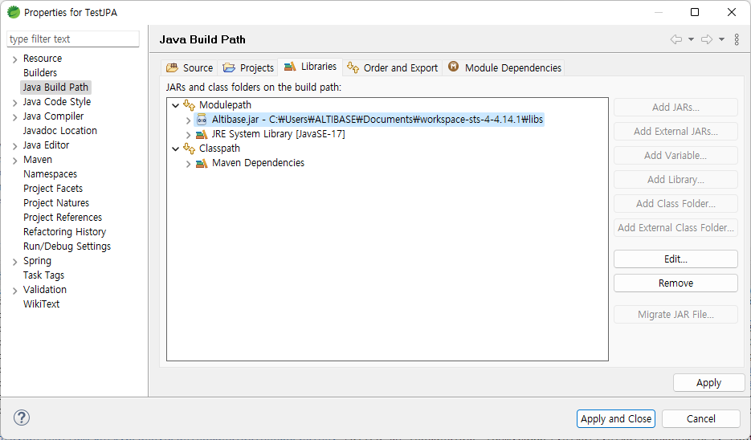

# Altibase JDBC Driver Setting

#### Prepare Altibase JDBC Driver

Download the Altibase JDBC driver to the path of user's choice. Altibase JDBC driver is Altibase.jar and this file exists in the lib directory where Altibase server is installed.

#### Add Altibase JDBC Driver File

Click Project -> Properties -> Java Build Path -> Libraries -> Add External JARs and add Altibase JDBC driver file.

 

