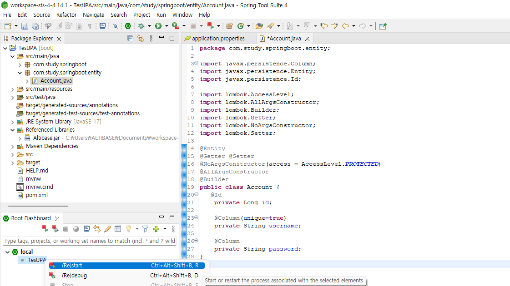

# Check the Connection with Altibase Server

#### Click Start

Select the project in the Boot Dashboard and click (Re)Start.



#### Check the Result

Check the result in the console.


#### Check if the Table is created

Connect to Altibase server with iSQL and check if the table is created.

```
iSQL> desc account;
[ TABLESPACE : SYS_TBS_MEM_DATA ]

[ ATTRIBUTE ]
------------------------------------------------------------------------------

NAME                                     TYPE                        IS NULL
------------------------------------------------------------------------------

ID                                       BIGINT          FIXED       NOT NULL
PASSWORD                                 VARCHAR(255)    VARIABLE
USERNAME                                 VARCHAR(255)    VARIABLE

[ INDEX ]
------------------------------------------------------------------------------

NAME                                     TYPE     IS UNIQUE     COLUMN
------------------------------------------------------------------------------

UK_GEX1LMAQPG0IR5G1F5EFTYAA1             BTREE    UNIQUE        USERNAME ASC
__SYS_IDX_ID_173                         BTREE    UNIQUE        ID ASC

[ PRIMARY KEY ]
------------------------------------------------------------------------------

ID
```

