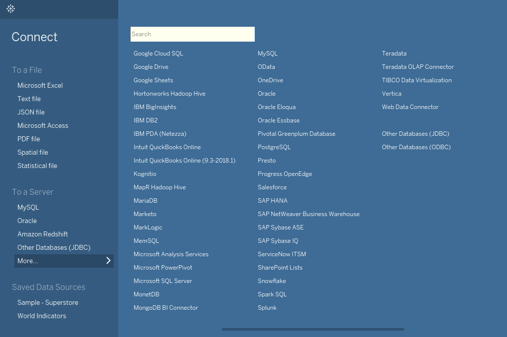
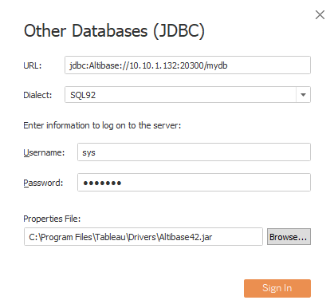
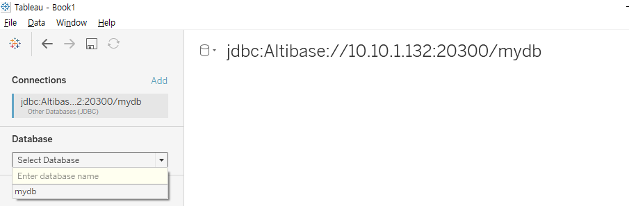

# How to Use Altibase on Tableau

1. Meet the prerequisites for the Altibase Server to connect to Tableau.

   - Add the following property in $ALTIBASE_HOME/conf/altibase.properties then run the server

     - TIMESTAMP_TO_DATE = 1

   - Download and execute [mysql_date_function.sql](https://github.com/ALTIBASE/Documents/tree/master/How%20to%20Use%203rd%20Party%20for%20Altibase/eng/Tableau%20User's%20Guide%20for%20Altibase/mysql_date_function.sql)

     ```
     iSQL> connect sys/manager;
     iSQL> @mysql_date_function.sql
     ```

2. Install Tableau.

3. Copy and paste Altibase JDBC driver in C:\\Program Files\\Tableau\\Drivers.

   - Altibase 7.1

     Use $ALTIBASE_HOME/lib/Altibase42.jar. (From Altibase 7.1.0.5.6, JDBC driver that partially supports JDBC API Specification 4.2 is provided additionally)

   - Altibase 7.2

     Use $ALTIBASE_HOME/lib/Altibase.jar.

4. Open Tableau, go to Connect > To a Server > More... and click Other Databases (JDBC).

   

5. Fill in the following entries to log in.

   - URL: jdbc:Altibase://***host_ip:port_no/database_name***
   - Username: User account
   - Password: User password
   - Properties File: Choose Altibase JDBC Driver (Below image is for Altibase 7.1)

   

6. The image below will be shown after logging in. Select the database from the list and select Taleau for schema.

   