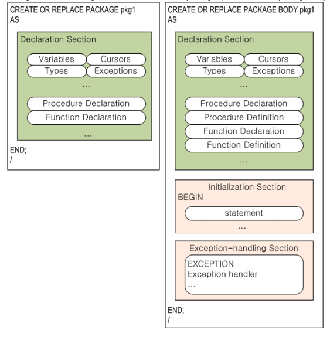
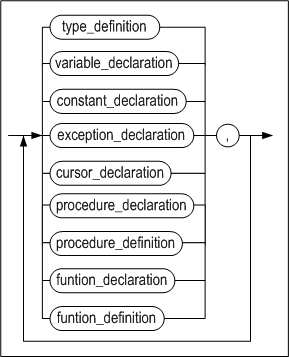

# 11. Stored Packages

This chapter describes how to create and use stored packages.

### Overview

A package is a grouped object of user-defined types, variables, constants, subprograms(procedures or functions), cursors and exceptions used for stored procedures. The package is composed of a package specification and a package body. Every package has a specification which defines user-defined types, or declares variables, constants, subprograms(procedures or functions), cursors, and exceptions. Objects declared in this manner can be referenced from outside the package. Moreover, the subprograms of packages can be utilized with overloading. Hence, the package specification is equivalent to the Application Programming Interface (API).

If cursors or subprograms are declared in the package specification, a package body must be created for the given package. The package body must define queries for cursors and code for subprograms. The package body can also declare and define objects; however, objects declared in this manner cannot be referenced from outside the package.

The package body can have an initialization part and an exception-handling part. The initialization part runs only once per session, when the package is executed for the first time. The user cannot directly access the package body, and its alteration does not affect the package specification. The package body is the part which is actually processed when a package object is referenced, and the package specification is the part which hides this from the outside. The package is loaded into memory on its first run per session, and is maintained until the given session is terminated.

#### Features

-   Modularity  
    Stored packages enable the user to modularize objects associated with a given operation, such as types, variables, constants, cursors, exceptions and subprograms.

-   Easy applicaiton program writing  
    The writing and maintenance of application programs are made easy with modularization.

-   Information security  
    Since the package body is only accessible via the package specification, implementation details can be hidden. Therefore, information can be secured by blocking access to the package body from the outside.

-   Performance enhancement  
    Since the package is loaded into the session on its first run, processing speed is fast for repeated calls made in the same session.

#### Structure

A package is composed of a package specification and a package body. Types, variables, constants, cursors, exceptions, subprograms, etc. can be declared in the declaration section of the package specification and package body; objects declared in the package specification can be further defined in the body.

The initialization part of the package body is an optional feature, and runs only once per session, when the package is executed for the first time. The initialization part is mainly used to set the values of variables declared or referenced inside a package. The package body can also write an exception-handling part.

The figure below is a diagram of the structure of the package specification and package body.




#### Restriction

-   Cursors defined inside a package stay open while subprograms are being executed; cursors are implicitly closed when subprograms have completed execution.


### CREATE PACKAGE

#### Syntax

##### create_package ::=


##### invoker_rights_clause::=


##### declare_section ::=


##### procedure_declaration ::=


##### function_declaration ::=


#### Purpose

This statement creates a package specification or substitutes a previously existing package specification.

##### invoker_rights_clause

When executing a package, it can be specified whether to execute with the DEFINER or the CURRENT_USER privileges. If this clause is omitted, the package is run with constructor privileges

-   AUTHID CURRENT_USER  
    This executes a package by referencing an object owned by the package user.

-   AUTHID DEFINER  
    This executes with creator privilege by referring to the object of package creator (DEFINER).

##### declare_section

Defines user-defined types or declares variables, constants, subprograms (procedures or functions), cursors and exceptions. For further information on the syntax of type_definition, refer to the "Defining a User-Defined Type" section of Chapter 6, and for further information on the syntax of the declare clause for variables, constants, cursors and exceptions, refer to the "Declaring Local Variables" section of Chapter 3.

#### Example

##### Example 1

This example creates a package specification which contains user-defined types, variables, procedures and functions.

```
CREATE OR REPLACE PACKAGE pkg1 AS
TYPE rec1 IS RECORD(c1 INTEGER, c2 INTEGER);
v1 rec1;
v2 INTEGER;
PROCEDURE proc1;
FUNCTION func1 RETURN INTEGER;
END;
/
```


##### Example 2 (AUTHID CURRENT_USER)

###### **Create object: user1**

```
iSQL> connect user1/user1;
Connect success.

iSQL> create table t1( c1 integer );
Create success.

iSQL> insert into t1 values ( 1 );
1 row inserted.

iSQL> create or replace package pkg1 authid current_user as
     var1 integer;
     procedure sub1;
     end;
     /
Create success.

iSQL> create or replace package body pkg1 as
     procedure sub1 as
     begin
     select c1 into var1 from t1;
     println( var1 );
     end;
     end;
     /
Create success.

iSQL> select package_name , package_type , authid
      from system_.sys_packages_
      where package_name = 'PKG1';
PACKAGE_NAME     
----------------------------
PACKAGE_TYPE AUTHID      
----------------------------
PKG1                                                                                                                              
6           1          
PKG1                                                                                                                              
7           1          
2 rows selected.
```


###### **Create object : user2**

```
iSQL> connect user2/user2;
Connect success.

iSQL> create table t1( c1 integer );
Create success.

iSQL> insert into t1 values ( 100 );
1 row inserted.
```


###### Execute package: user1**

```
iSQL> exec pkg1.sub1;
1
Execute success.
```


###### **Execute package: user2**

```
iSQL> exec user1.pkg1.sub1;
100
Execute success.
```


##### Example 3 (AUTHID DEFINER)

###### **create object: user1**

```
iSQL> connect user1/user1;
Connect success.

iSQL> create table t1( c1 integer );
Create success.

iSQL> insert into t1 values ( 1 );
1 row inserted.


iSQL> create or replace package pkg1 authid definer as
     var1 integer;
     procedure sub1;
     end;
     /
Create success.

iSQL> create or replace package body pkg1 as

     procedure sub1 as
     begin
     select c1 into var1 from t1;
     println( var1 );
     end;

     end;
     /
Create success.

iSQL> select package_name , package_type , authid
    2 from system_.sys_packages_
    3 where package_name = 'PKG1';
PACKAGE_NAME                                                                                                                      
------------------------------------------------------------------------------------------------------------------------------------
PACKAGE_TYPE AUTHID      
----------------------------
PKG1                                                                                                                              
6           0          
PKG1                                                                                                                              
7           0          
2 rows selected.
```


###### **Create object: user2**

```
iSQL> connect user2/user2;
Connect success.

iSQL> create table t1( c1 integer );
Create success.

iSQL> insert into t1 values ( 100 );
1 row inserted.
```


###### **Execute package: user1**

```
iSQL> exec pkg1.sub1;
1
Execute success.
```


###### **Execute package: user2**

```
iSQL> exec user1.pkg1.sub1;
1
Execute success.
```


### CREATE PACKAGE BODY

#### Syntax

##### create_package_body ::=


##### initialize_section::=


##### declare_section ::=



#### Purpose

This statement creates the package body or substitutes a previously existing package body.

##### declare_section

Defines all cursors and subprograms declared in the package specification. Each subprogram declaration of the package specification must be identical to the corresponding definition of the package body.

Declares an object which can be referenced only within the package; it can also define such an object.

For more detailed information on the syntax of *type_definition*, refer to the "Defining a User-Defined Type" section of Chapter 6, and for further information on the syntax of the declare clause for variables, constants, cursors and exceptions, refer to the "Declaring Local Variables" section of Chapter 3. For further information on the syntax of procedure and function definitions, refer to the "CREATE PROCEDURE" and "CREATE FUNCTION" section of Chapter 2.

##### initialize_section

This writes the package initialization and exception-handling parts of the package. *initialize_section* is executed at the initial invocation of the package during a session; if the package is repeatedly called on the same session, this section is not executed.

#### Example

\<Example 1\>  This example shows an error being raised, due to the package body being created without the package specification.

```
iSQL> select * from system_.sys_packages_ where package_name = 'PKG2';
No rows selected.

iSQL> create or replace package body pkg2 as
      v1 integer;
      procedure proc1 as
      begin
      v1 := 1;
      end;
      end;
      /
[ERR-313BE : Package specification not found. ]
```

\<Example 2\> This example successfully creates the package specification and the package body.

```
CREATE OR REPLACE PACKAGE pkg1 AS
TYPE rec1 IS RECORD(c1 INTEGER, c2 INTEGER);
v1 rec1;
v2 INTEGER;
PROCEDURE proc1;
FUNCTION func1 RETURN INTEGER;
END;
/

iSQL> create or replace package body pkg1 as
type rec2 is record(c3 integer, c4 integer);
v3 rec1;
v4 rec2;
v5 integer;
procedure proc1 as
  begin
  v5 := 1;
  v2 := 2;
end;
function func1 return integer as
  begin
  return v2;
end;
end;
/
Create success.
```

\<Example 3\> This example creates the package body with the initialize_section and executes it. This example shows the initialize_section being executed on the initial call only.

```
create or replace package pkg1 as
v1 integer;
procedure proc1;
end;
/
create or replace package body pkg1 as
v2 integer;
procedure proc1 as
v3 integer;
begin
  v3 := v1 + v2;
  println(v3);
  println('statement 1');
end;
begin
  v1 := 100;
  v2 := 31;
  println('statement 2');
end;
/

iSQL> exec pkg1.proc1;
statement 2
131
statement 1
Execute success.
iSQL> exec pkg1.proc1;
131
statement 1
Execute success.
```

\<Example 4\> This is the usage of package overloading with the same name of package subprorams but different data types.

```
iSQL> create or replace package pkg1 as
function func return varchar(10);
function func(p1 in varchar ) return varchar(10);
function func(p1 in number ) return varchar(10);
function func(p1 in date ) return varchar(10);
end;
/
Create success.

iSQL> create or replace package body pkg1 as
function func return varchar(10) is
begin
return 'none';
end;
function func(p1 in varchar ) return varchar(10) is
begin
return 'varchar';
end;
function func(p1 in number ) return varchar(10) is
begin
return 'number';
end;
function func(p1 in date ) return varchar(10) is

begin
return 'date';
end;
end;
/
Create success.
```


#### Note

-   The package specification must be created at first in order to create the package body.
-   Not a single procedure or function specified in the package specification should be omitted at all and it must be included in the package body.
-   Data types can be matched by using functions, such as CAST and TO_DATE in order to prevent unwanted execution of subprogram with overloading of subprogram package.

### ALTER PACKAGE

#### Syntax

##### alter_package ::=


#### Purpose

This statement explicitly recompiles the package specification, the package body or the package. When the package is recompiled, variables, cursors, user-defined types and subprograms that compose the package are also recompiled.

#### Examples

```
iSQL> alter package pkg1 compile;
Alter success.

iSQL> alter package pkg1 compile specification;
Alter success.

iSQL> alter package pkg1 compile body;
Alter success.

iSQL> alter package pkg1 compile package;
Alter success.
```


### DROP PACKAGE

#### Syntax

##### drop_package ::=


#### Purpose

This statement drops the package. This statement can selectively drop only the package body or the whole package.

#### Examples

```
iSQL> drop package body pkg1;
Drop success.

iSQL> drop package pkg1;
Drop success.
```


### EXECUTE

#### Syntax

##### execute_procedure_statement ::=


##### execute_function_statement ::=


#### Purpose

This statement executes procedures or functions inside the package

#### Examples

```
create or replace package pkg1 as
v1 integer;
procedure proc1;
function func1 return integer;
end;
/

create or replace package body pkg1 as
procedure proc1 as
begin
println(v1);
end;

function func1 return integer as
begin
return 1;
end;
end;
/

iSQL> exec pkg1.v1 := pkg1.func1;
Execute success.

iSQL> exec pkg1.proc1;
1
Execute success.
```


