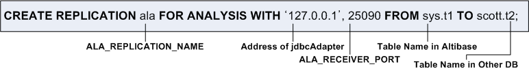

# 3. Usage Instructions

This chapter describes how to use the Adapter for JDBC.

### jdbcAdapter Constraints

There are several constraints in order to properly use jdbcAdapter. jdbcAdapter cannot be used If the following conditions are not satisfied.

#### Prerequisite 

-   If there is a conflict in input/modify/delete operation in the target DB(Other DB), the operation is canceled and the message is left in the error log file or ignored according to the setting. 
-   The error ocurred during the replication can be partially revoked. That is to say, if there is replication data while inputting multiple data, the rest of the data is completed except the replication data. 
-   The replication speed might be slower than the service speed

#### Data Constraints

-   Primary key is required in the table to be replicated.

-   To be replicated, primary key of the table cannot be modified.
-   Tables to be replicated on both servers must have the same order and primary key constraints.

#### Connection Constraints

The maximum number of possible XLog Senders and replicated connections in Altibase database is determined by the value set in the REPLICATION_MAX_COUNT property.

#### Allowed DDL Statements

Generally, replication target table cannot execute the data definition language (DDL). However, the following DDLs can be executed regardless of XLog Sender. Refer to Executing DDL Statements on Replication Target Tables in the *Replication Manual* for more information on other allowed DDL statements.

-   ALTER INDEX SET PERSISTENT = ON/OFF

-   ALTER INDEX REBUILD PARTITION

-   GRANT OBJECT

-   REVOKE OBJECT

-   CREATE TRIGGER

-   DROP TRIGGER

#### Allowed DDL statements in Replication Target Tables

In general, if a data definition language (DDL) is executed on a replication target table, jdbcAdapter is terminated after all changes that occurred before the current DDL are reflected in the target database. When jdbcAdapter is terminated, replication can be performed again by executing the same DDL on the target database to make the table schema the same and restarting jdbcAdapter.

For other DDLs that can be executed, please refer to Execution DDL Statements on Replication Target Tables in the *Replication Manual.*

### Startup and Shutdown

This section describes how to start and stop jdbcAdapter.

#### Startup

This section explains how to run jdbcAdapter step by step.

To use jdbcAdapter, Altibase and Other DB to which data is to be sent must be running first. Also, Adapter for JDBC properties and environment variables jdbcAdapter must be properly configured as an environment that can be executed.

If any environment variable or property is changed after jdbcAdapter is started, jdbcAdapter must be restarted to apply this change. For detailed information on setting environment variables, refer to Chapter 2, “Post Installation Tasks”.

1. Verify if Altibase's REPLICATION_PORT_NO<sup>1</sup> property is actually set to the replication port number. If the change of this property setting is needed, Altibase must be restarted.
  
   [<sup>1</sup>] REPLICATION_PORT_NO specifies the replication port number used by the local server for replication connections. For more information about this property, please refer to the *Getting Started Guide.*

2. Before starting jdbcAdapter, the user must configure the XLog sender so that Altibase Log Analyzer (ALA) can be used. XLog sender is used to send XLog and meta information from Altibase.  
   Using PROPAGABLE LOGGING to transfer the log of a replicated transaction to another server, FOR ANALYSIS PROPAGATION must be used.   
   The following statement creates XLog Sender to replicate data in the table t1 owned by the sys user in Altibase to the table t2 which is owned by user2 in Altibase DB.

```
CREATE REPLICATION ala FOR ANALYSIS WITH '127.0.0.1', 25090
FROM sys.t1 TO user1.t2;
```



3. Now, it is time to start jdbcAdapter. jdbcAdapter can be started by executing it directly or by using Adapter for JDBC utility. For more detailed information on how to start jdbcAdapter with the Adapter for JDBC utility, please refer to [Adapter for JDBC Utility](#adapter-for-jdbc-utility) in this manual. It should be noted that the jdbcsAdapter can be started with the following command in the LINUX operating system. 

```
$ cd $JDBC_ADAPTER_HOME/bin
$ ./jdbcAdapter
```

4. Start XLog sender for Altibase Log Analyzer. Attempting to start the XLog sender before running jdbcAdapter will fail. 

```
iSQL> ALTER REPLICATION ala START;
```

#### Shutdown

The process of shutting down the jdbcAdapter includes stopping the XLog sender. If the jdbcAdapter is forcibly terminated using the Adapter for JDBC utility, it will be successfully terminated, but the Altibase XLog sender will continue to attempt to connect with the jdbcAdapter.

```
iSQL> ALTER REPLICATION ala STOP;
Alter success.
```

### Data Types

When Altibase data is applied to other db using JDBC, it is converted to JAVA String type and applied. However, the DATE type is converted to JAVA Timestamp type and applied.

The supported data types are FLOAT, NUMERIC, DOUBLE, REAL, BIGINT, INTEGER, SMALLINT, DATE, CHAR, VARCHAR, NCHAR, and NVARCHAR.

### Adapter for JDBC Utility

Adapter for JDBC utility (oaUtility) is a script that runs jdbcAdapter with the daemon and checks its status. This script is executed in the bash shell in which GNU sed is installed. Constraints on other DB are not checked.

The Adapter for JDBC Utility supports the following options:

-   oaUtility start

-   oaUtility stop

-   oaUtility status

-   oaUtility check

#### oaUtility start

##### Syntax

```
oaUtility {start}
```

##### Description

This is used to start jdbcAdapter as a daemon.

#### oaUtility stop

##### Syntax

```
oaUtility {stop}
```

##### Description

This option forcbily terminates jdbcAdapter which is currently processing.

#### oaUtility status

##### Syntax

```
oaUtility {status}
```

##### Description

This is used to check whether jdbcAdapter is running.

#### oaUtility check

##### Syntax

```
oaUtility { check [ alive ] }
```

##### Description

This option is used to continuously check whether jdbcAdapter operates or not, and restarts if oaUtility is terminated(regardless of normal shutdown or forcible shutdown). 

If the alive option is specified, only one check is made to see if jdbcAdapter is running, and then oaUtility is terminated

### Command-Line Option

jdbcAdapter provides the following command options.

#### Syntax

```
jdbcAdapter [ -v | -version ]
```

##### Description

This option is used to output the version of Altibase with which jdbcAdapter was compiled.

##### Example

```
$./jdbcAdapter -v
Adapter for JDBC version 7.1.0.0.2
...
```

