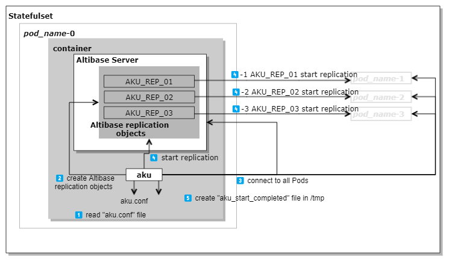
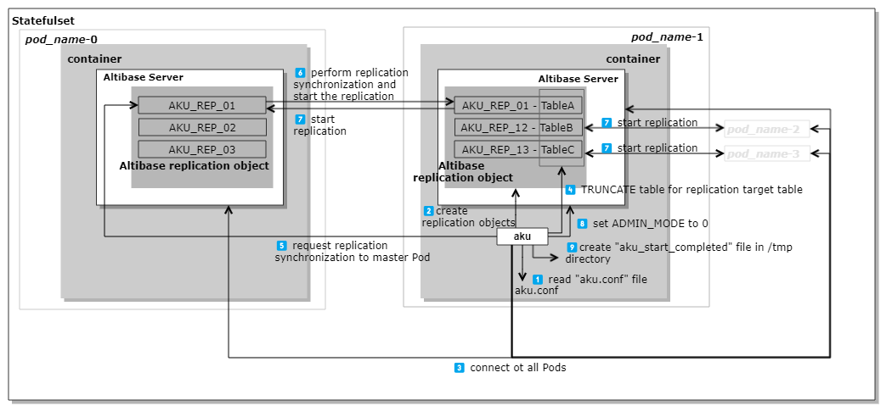
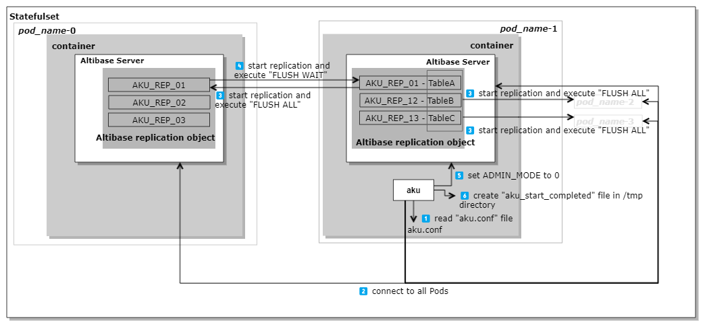
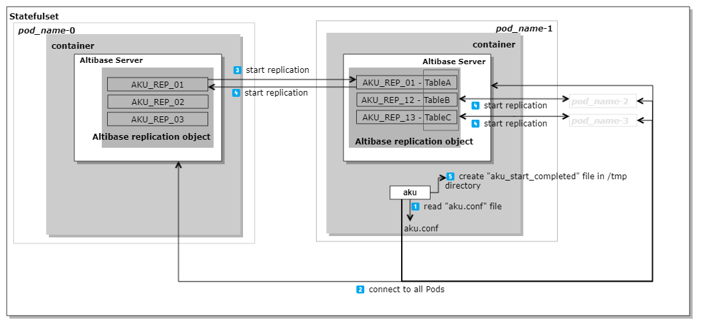
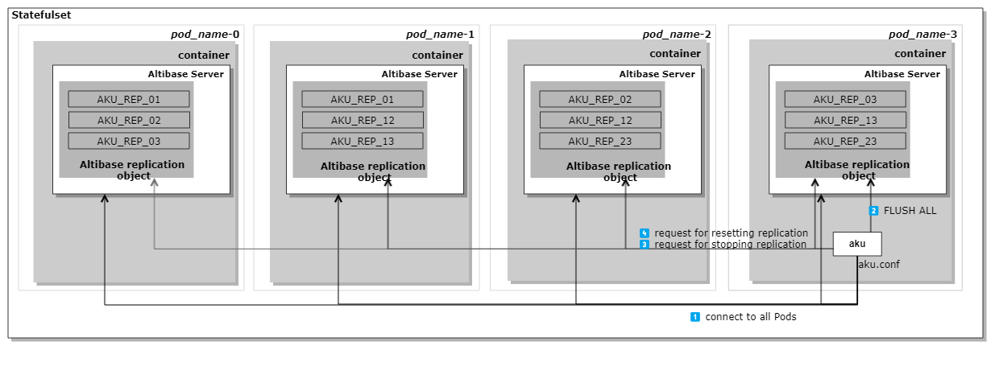

# 3. aku

## Introducing aku

### Overview

Altibase Kubernetes Utility (AKU) is a utility that helps you perform tasks such as synchronizing data in Altibase with the start and termination of Pods or resetting synchronization information when scaling in a Statefulset in Kubernetes. Aku supports data replication among Pods but does not support Altibase's data scale-out feature.

> StatefulSets are one of Kubernetes' workloads for supporting stateful applications like databases, and scaling means creating or terminating pods. A Pod is a resource in Kubernetes that contains containers, and Altibase server runs on these containers.

When scaling up or down on a StatefulSet, you can use aku to start or terminate pods that meet the following conditions. You should add the command in the appropriate location so that aku runs on the Altibase container.

#### When scaling up

You can use aku, if you want to create a Pods with the same data as Altibase server in an existing Pod.

#### When scaling down

You can use aku, if you want to initialize the replication information of Altibase server when Pods are terminated.

### Component

> ⚠️ Aku should be running with a same version in all Pods, and the aku configuration files should have same values. Basically, aku and aku configuration file are included in the Altibase container image.
>
> Altibase Server and aku should be executed within the same container.

#### aku

Aku is located in $ALTIBASE_HOME/bin. To execute aku, you need to set $ALTIBASE_HOME and add $ALTIBASE_HOME/bin to $PATH.

#### aku.conf

aku.conf is the configuration file for aku. When executing aku, it reads aku.conf file to obtain the information needed for Altibase data synchronization. Altibase provides aku.conf.sample in $ALTIBASE_HOME/conf directory. Before running aku, generate the aku.conf file in the same directory using aku.conf.sample.

The aku.conf.sample file is as follows:

```
# aku.conf.sample

AKU_SYS_PASWWORD        = "manager"
AKU_STS_NAME            = "altibase-sts"
AKU_SVC_NAME            = "altibase-svc"
AKU_SERVER_COUNT        = 4
AKU_QUERY_TIMEOUT       = 3600
AKU_PORT_NO             = 20300
AKU_REPLICATION_PORT_NO = 20301
AKU_FLUSH_AT_START         = 1
AKU_FLUSH_TIMEOUT_AT_START = 300
AKU_FLUSH_AT_END           = 1
AKU_ADDRESS_CHECK_COUNT    = 30
AKU_DELAY_START_COMPLETE_TIME = 0

REPLICATIONS = (
    REPLICATION_NAME_PREFIX = "AKU_REP"
    SYNC_PARALLEL_COUNT     = 1
    (
        (
            USER_NAME       = "SYS"
            TABLE_NAME      = "T1"
        ),
        (
            USER_NAME       = "SYS"
            TABLE_NAME      = "T2"
        ),
        (
            USER_NAME       = "SYS"
            TABLE_NAME      = "T3"
        )
    )
)
```

For details of each properties, refer to [aku-properties](#aku-properties).

## Setup to run aku

### Prerequisite

To ensure stable usage of aku in a Kubernetes environment, the following conditions must be met:

* It should be used only in **StatefulSets** among Kubernetes workload.
* The **Pod management policy should be OrderedReady**. OrderedReady is the default policy for StatefulSets.
* The maximum number of scalable replicas is **up to 4**.

* **Altibase server and aku** should be executed within the same container.
* `aku -p start` command should be performed after Altibase server has started successfully.

* After completing `aku -p start` command on a Pod, it should sequentially create the next Pod. This requires to configure the **Startup Probe** in Kubernetes.
* **Startup Probe** configuration is needed to verify if `aku -p start` command has been successfully executed. You can use the presence of the aku_start_completed file in the /tmp directory as an indicator for verification.
* Set **publishNotReadyAddress** to true.
* `aku -p end` command should be performed before stopping the Altibase server.
* A Pod should be terminated after `aku -p end` command completes successfully.

* Kubernetes's **terminationGracePeriodSeconds** should be set to a large value to allow aku to complete its tasks successfully before Pod is terminated.

### Altibase Environment Variable and Properties

* Altibase Environment 
  * $ALTIBASE_HOME
    * Sets the directory in which Altibase server was installed. This must be set to use aku.

* Altibase Properties
  * set ADMIN_MODE to 1.
  * set REMOTE_SYSDBA_ENABLE to 1.


### aku Properties

| Property name                        | Default value | Description                                                  |
| :----------------------------------- | :-----------: | :----------------------------------------------------------- |
| AKU_STS_NAME                         |     none      | The name of the StatefulSet defined in the Kubernetes object specification. |
| AKU_SVC_NAME                         |     none      | The Service name that provides the Network Service defined in the Kubernetes object specification. |
| AKU_SERVER_COUNT                     |       4       | The maximum number of Altibase servers that can be synchronized using aku. It also refers to the number of Pods that can be scaled up in Kubernetes. </br>It can be set from 1 to 4. |
| AKU_SYS_PASSWORD                     |     none      | Database SYS user password                                   |
| AKU_PORT_NO                          |     20300     | Altibase Server Port number.<br />It can be set from 1024 to 65535. |
| AKU_REPLICATION_PORT_NO              |     20301     | Altibase Replication Port number.<br />It can be set from 1024 to 65535. |
| AKU_QUERY_TIMEOUT                    |     3600      | It refers to Altibase server property QUERY_TIMEOUT. If the execution time of SQL statements executed by aku exceeds AKU_QUERY_TIMEOUT value, the statement is canceled. |
| AKU_FLUSH_AT_START                   |       1       | This property determines whether replication gaps should be removed or not, during the execution of the `aku -p start` command. The default value is 1 and it means that replication gaps are removed by using FLUSH command.  </br>When this value is set to 0, replication gaps will not be removed. |
| AKU_FLUSH_TIMEOUT_AT_START           |      300      | This property sets the *wait_time* for the FLUSH WAIT command. When AKU_FLUSH_AT_START is 1 and AKU_FLUSH_TIMEOUT_AT_START is 1 or greater, it performs FLUSH WAIT  with the specified *wait_time*. </br>If AKU_FLUSH_AT_START is 1 and AKU_FLUSH_TIMEOUT_AT_START is 0, it performs FLUSH ALL. |
| AKU_FLUSH_AT_END                     |       1       | This property determines whether replication gaps should be removed or not, during the execution of the `aku -p end` command on the Slave Pod. The default value is 1 and it means that replication gaps are removed by using FLUSH ALL command.<br />When this value is set to 0, replication gaps will not be removed. |
| AKU_ADDRESS_CHECK_COUNT              |      30       | The number of attempts to connect to the local IP for checking if the DNS address of the currently created Pods is registered in the Kubernetes service (indicating whether communication between internal Pods is possible) when running `aku -p start`. |
| AKU_DELAY_START_COMPLETE_TIME        |       0       | This property specifies a waiting time (in seconds) after the replication starts on the Slave Pod in the `aku -p start` process. <br />This configuration is to set the wait time for performing the operation of changing the Altibase property ADMIN_MODE to 0, after the data synchronization is completed during the scaling up process with `aku -p start`. |
| AKU_REPLICATION_RESET_AT_END         |               | This property determines whether to perform a reset of the replication information or not. |
| REPLICATIONS/REPLICATION_NAME_PREFIX |     none      | Prefix of replication object's name that is created by aku.<br/>e.g.,*REPLICATION_NAME_PREFIX*_\[*Pod Number*]\[*Pod Number*\]  <sup>[Naming rule of replication object in aku](#rep_name_rules)</sup> |
| REPLICATIONS/SYNC_PARALLEL_COUNT     |       1       | The number of threads for sending and receiving during  replication sync.<br />It can be set from 1 to 100. |
| REPLICATIONS/USER_NAME               |     none      | User name of replication target table.<br />REPLICATION USER_NAME must be created before executing the "aku -p" command |
| REPLICATIONS/TABLE_NAME              |     none      | Name of replication target table. Non-partitioned table and partitioned table can also be specified. <br />REPLICATION TABLE_NAME must be created before executing the "aku -p" command |

> <a name="rep_name_rules"> **Naming rule of replication object in aku**</a>

Altibase replication object names that aku creates are generated with the following rule *REPLICATION_NAME_PREFIX*_\[*Pod Number*]\[*Pod Number*\]. The StatefulSet creates Pods sequentially in the order *Pod_name*\_0, *Pod_name*\_1, ..., *Pod_name*\_*N*-1, with each Pod having a unique sequence number. In the Altibase replication object name, the Pod number is composed of the sequence numbers of Pods that form a replication pair.

For example, when AKU_SERVER_COUNT is 4 and REPLICATION_NAME_PREFIX is "AKU_REP", the names of the replication objects created in each Pod are as follows.

| Pod Number   | Replication object name | Description                                                  |
| :----------- | :---------------------- | :----------------------------------------------------------- |
| *pod_name*-0 | AKU_REP_01              | Replication object name between *pod_name*-0 and *pod_name*-1 |
|              | AKU_REP_02              | Replication object name between  *pod_name*-0 and *pod_name*-2 |
|              | AKU_REP_03              | Replication object name between  *pod_name*-0 and *pod_name*-3 |
| *pod_name*-1 | AKU_REP_01              | Replication object name between  *pod_name*-0 and *pod_name*-1 |
|              | AKU_REP_12              | Replication object name between  *pod_name*-1 and *pod_name*-2 |
|              | AKU_REP_13              | Replication object name between  *pod_name*-1 and *pod_name*-3 |
| *pod_name*-2 | AKU_REP_02              | Replication object name between  *pod_name*-0 and *pod_name*-2 |
|              | AKU_REP_12              | Replication object name between  *pod_name*-1 and *pod_name*-2 |
|              | AKU_REP_23              | Replication object name between  *pod_name*-2 and *pod_name*-3 |
| *pod_name*-3 | AKU_REP_03              | Replication object name between  *pod_name*-0 and *pod_name*-3 |
|              | AKU_REP_13              | Replication object name between  *pod_name*-1 and *pod_name*-3 |
|              | AKU_REP_23              | Replication object name between  *pod_name*-2 and *pod_name*-3 |

⚠️ Don't create/drop/modify carelessly the Altibase replication objects created by aku.

## Usage of aku

### Syntax

```
aku { -h | -v | -i | -p {pod_action} }
```

### Parameters

#### -h, --help

Displays the usage of aku

#### -v, --version

Displays the version information of aku. It is recommended to use the same version of aku as Altibase server.


#### -i, --info

Displays the following informations defined in aku.conf file.

- Altibase Server Information
  - Server ID
  - Host
  - User
  - Password
  - Port
  - Replication Port
  - Max Server Count : Maximum number of scalable Pods

- Replication Information
  - Replication object's name

- Replication Items
  - Replication Target table and User Name

#### -p, --pod {*pod_action*}

Specify the action to be performed with aku. *pod_action* options are "start", "end", and "clean".

### pod_action with aku

The followings introduce the action performed during execution of aku.

#### aku -p start

It creates Altibase replication objects and synchronizes data. You can use the command when starting Pods.

The following shows the detailed behavior of  `aku -p start` command.

>  ⚠️ `aku -p start` command should be performed after Altibase server has started successfully.

##### Creation of Master Pod (Creation of the first Pod)

It's the first Pod created in a StatefulSet , specified as *pod_name*-0. The Pod is called as "Master Pod" in aku and the executed aku is called as "MASTER AKU".

Since Altibase replication objects need to be created on all Pods, you should execute `aku -p start` command even if creating *pod_name*-0 in a StatefulSet.

The followings explain the detailed behavior of  `aku -p start` command during creating *pod_name*-0 in a StatefulSet.

<div align="left">
    </img>
</div>


  1️⃣ Reads aku.conf file.

  2️⃣ Creates Altibase replication objects, and the number of objects created is equal to AKU_SERVER_COUNT minus 1. If a replication object with the same name already exists, this step(the replication creation phase) is skipped.

  3️⃣ Attempts to connect to all Pods, which are replication target servers. However, since other Pods are not yet created, an error occurs when attempting to establish a connection. This is the expected behavior.

  4️⃣ Starts the replication objects created in step 2️⃣ by using the command "ALTER REPLICATION *replication_name* START". However, since other Pods are not yet created, the replication fails to start. Once the other Pods are created and ready for replication, the replication will successfully start. This behavior is normal and expected.

  5️⃣ Creates a file named "aku_start_completed" in /tmp/ directory.

##### **Scale up**

When scaling up in a StatefulSet, new Pods are created. The new Pod is called as "Slave Pod" in aku and the executed aku is called as "SLAVE AKU".  A Pod can be created and terminated repeatedly. The behavior of `aku -p start` is a little different when a Pod is first created and when it is restarted after being terminated.

> **When creating a Slave Pod for the first time, or restart (Default behavior, AKU_REPLICATION_RESET_AT_END =1)**

Followings explain the detailed behavior of  `aku -p start` command on *pod_name*-1 when the Slave Pod is created for the first time and is restarted normally. 

<div align="left">
    </img>
</div>


1️⃣ Reads aku.conf file.

2️⃣ Creates Altibase replication objects, and the number of objects created is equal to AKU_SERVER_COUNT minus 1. For example, if *pod_name*-1 is the restarted Pod, the name already exists, so this step is skipped. 

3️⃣ Attempts to connect to all Pods, which are replication target servers. Only the connection with *pod_name*-0 successes and connection errors occurs on the other Pods(*pod_name*-2, *pod_name*-3) , since they have not been created yet. This is the expected behavior.

4️⃣ Executes 'TRUNCATE table' on the replication target table in *pod_name*-1. 

5️⃣ Requests *pod_name*-0(the master node) to perform replication synchronization. 

6️⃣ Performs replication synchronization from *pod_name*-0 to *pod_name*-1 and starts the replication.

7️⃣ Executes the command to start the replications from *pod_name*-1 to all Pods (*pod_name*-0 ,*pod_name*-2, *pod_name*-3) and request the start of the replications among the other Pods. Since *pod_name*-2 and *pod_name*-3 are not yet created, the replication fails to start. This behavior is normal and expected. If *pod_name*-2 and *pod_name*-3 are created and ready for replication, the replication will successfully start by executing `aku -p start` on each Pod.

8️⃣ Sets the Altibase server property ADMIN_MODE to 0 on *pod_name*-1 to allow to access for database user. 

9️⃣ Creates a file named "aku_start_completed" in /tmp/ directory.

##### Restarting Slave Pods that Haven't Reset the Replication Information

>  **Case of restarting  a Slave Pod that hasn't reset the replication information (Default behavior, AKU_FLUSH_AT_START = 1)** 

The following explanation describes the basic behavior of aku when executing `aku -p start` on a Slave Pod that hasn't reset the replication information.

If a Pod is abnormally terminated or terminated with the AKU_REPLICATION_RESET_AT_END property sets to 0, the replication information is not initialized. If the replication information were not initialized, when restarting Pods the previous replication information would exist, so the below data synchronization actions from other nodes are skipped.

* Executes 'TRUNCATE table' on the replication target table.
* Requests for performing replication synchronization.

In this case, if the AKU_FLUSH_AT_START property sets to 1, data synchronization from itself to other nodes will be performed.

Note that if the replication information is not reset and remains, the XSN of the replication object has a value other than -1. Refer to the Cautions- 3). 

<div align="left">
    </img>
</div>


1️⃣ Reads aku.conf file.

2️⃣ Attempts to connect to all Pods, which are replication target servers. Only the connection with *pod_name*-0 successes and connection errors occurs on the other Pods(*pod_name*-2, *pod_name*-3) , since they have not been created yet. This is the expected behavior.

3️⃣ Starts the replications from *pod_name*-1 to all Pods( *pod_name*-0, *pod_name*-2, *pod_name*-3) and execute "ALTER REPLICATION ... FLUSH ALL". This is for data synchronization from *pod_name*-1 to other Pods. Since *pod_name*-2 and *pod_name*-3 are not yet created, the command to the Pods fails to execute. This behavior is normal and expected. If *pod_name*-2 and *pod_name*-3 are created and ready for replication, aku makes the replication start and executes "FLUSH ALL" by executing `aku -p start` on each Pod.      

4️⃣ Starts a replication from *pod_name*-0 to *pod_name*-1 and  execute "ALTER REPLICATION ... FLUSH WAIT *wait_time*". *wait_time* refer to the aku property AKU_FLUSH_TIMEOUT_AT_START in aku.conf file. This is for data synchronization from *pod_name*-0 to  *pod_name*-1.

5️⃣ Sets the Altibase server property ADMIN_MODE to 0 on *pod_name*-1 to allow to access for database user. 

6️⃣ Creates a file named "aku_start_completed" in /tmp/ directory.


> **Case of restarting  a Slave Pod that hasn't reset the replication information (AKU_FLUSH_AT_START = 0)** 

The following explanation describes the behavior of aku when executing `aku -p start` on a Slave Pod that hasn't reset the replication information, with the property AKU_FLUSH_AT_START set to 0.

<div align="left">
    </img>
</div>


1️⃣ Reads aku.conf file.

2️⃣ Attempts to connect to all Pods, which are replication target servers. Only the connection with *pod_name*-0 successes and connection errors occurs on the other Pods(*pod_name*-2, *pod_name*-3) , since they have not been created yet. This is the expected behavior.

3️⃣ Starts a replication from *pod_name*-0 to *pod_name*-1.

4️⃣ Executes the command to start the replications from *pod_name*-1 to all Pods (*pod_name*-0 ,*pod_name*-2, *pod_name*-3) and request the start of the replications among the other Pods. Since *pod_name*-2 and *pod_name*-3 are not yet created, the replication fails to start. This behavior is normal and expected. If *pod_name*-2 and *pod_name*-3 are created and ready for replication, the replication will successfully start by executing `aku -p start` on each Pod.

5️⃣ Creates a file named "aku_start_completed" in /tmp/ directory.


#### **aku -p end**

The command should be used when terminating Pods. It performs to stop Altibase replication and reset the replication information. 

<div align="left">
    </img>
</div>


1️⃣ Attempts to connect to all Pods, which are connected with the current Pod. Since Pods are terminated sequentially, connection errors can occur when attempting to connect to already deleted Pods. This is an expected behavior.

2️⃣ Sends the replication change logs to the replication objects of current Pod by executing 'ALTER REPLICATION *replication_name* FLUSH ALL'. If the AKU_FLUSH_TIMEOUT_AT_START property is set to 0, this step is skipped.

3️⃣ Requests to perform "ALTER REPLICATION *replication_name* STOP" on all Pods related to current Pod.

4️⃣ Requests to perform "ALTER REPLICATION *replication_name* RESET" on all Pods related to current Pod. If the AKU_REPLICATION_RESET_AT_END property is set to 0, this step is skipped.

> ⚠️ `aku -p end` command should be performed before stopping the Altibase server.

#### **aku -p clean**

The command is to drop all replication objects from all Pods. It is used when there is no longer a need for synchronization among Pods.

<br/>

## Cautions

### 1) aku.conf

* Don't use comment in aku.conf file. If an comment is added in aku.conf file, it displays `Cannot parse aku.conf` error.
* Don't delete aku properties that has a default value of "none" (such as AKU_STS_NAME, AKU_SVC_NAME, etc.) from the aku.conf file and don't set values of the properties to "". It displays `[ERROR] Property [property_name] should be specified by configuration.`  

### 2) Storage corruption in Master Pod

Data corruption due to storage corruption in Master Pod is not guaranteed.

### 3) If the situation in which Pod was force terminated before `aku -p end` command completed or terminated with the property AKU_REPLICATION_RESET_AT_END set to 0, continues for a long time

If the situation in which a Pod was force-terminated before the 'aku -p end' command completed or terminated with the property AKU_REPLICATION_RESET_AT_END set to 0 continues for a long time, there is a possibility of uninitialized replication information remaining in the terminated Pod as well as in other Pods. When this happens, the other Pods do not delete the online log files that are required for replication to the terminated Pod. If the online log file accumulates a lot, it can lead to disk space exhaustion and result in Altibase server not being able to operate normally. To prevent this situation, if you notice that there are long periods of time in which a Pod was terminated before the `aku -p end` command completed, you should stop replication and initialize the replication information. Refer to the commands below. 

~~~sql
ALTER REPLICATION replication_name STOP;
ALTER REPLICATION replication_name RESET;
~~~

Suppose *pod_name*-1 failed to complete `aku -p end` and and terminated abnormally while *pod_name*-0 and *pod_name*-1 are both operational. Let's check the XSN of SYSTEM_.SYS_REPLICATIONS_ on *pod_name*-0. You can see that the XSN value of the replication object AKU_REP_01 is not -1. It means that the replication information is not initialized. AKU_REP_01 is the replication object between *pod_name*-0 and *pod_name*-1.

~~~sql
iSQL> SELECT REPLICATION_NAME, XSN FROM SYSTEM_.SYS_REPLICATIONS_;
REPLICATION_NAME                XSN                  
--------------------------------------------------------
AKU_REP_03                      -1
AKU_REP_02                      -1
AKU_REP_01                      859070110
No rows selected.
~~~

Execute the statements for stopping and resetting replication of the object(AKU_REP_01) on *pod_name*-0.

~~~sql
iSQL> ALTER REPLICATION AKU_REP_01 STOP;
Alter sucess.

iSQL> ALTER REPLICATION AKU_REP_01 RESET;
Alter sucess.
~~~

And then, let's check the XSN of SYSTEM_.SYS_REPLICATIONS_ on *pod_name*-0. The XSN value of the replication object AKU_REP_01 was changed to -1.

~~~sql
iSQL> SELECT REPLICATION_NAME, XSN FROM SYSTEM_.SYS_REPLICATIONS_;
REPLICATION_NAME                XSN                  
--------------------------------------------------------
AKU_REP_03                      -1
AKU_REP_02                      -1
AKU_REP_01                      -1
No rows selected.
~~~

<br/>

## Example

### aku -i

This is the result of running `aku -i` and displays the information set in aku.conf. A server with Server ID 0 is that of the first Pod created by the StatefulSet.

~~~bash
$ aku -i
  #########################
 [ Server ]
  Server ID        : 0
  Host             : AKUHOST-0.altibase-svc
  User             : SYS
  Password         : manager
  Port             : 20300
  Replication Port : 20301
  Max Server Count : 4
 #########################
 [ Replications ]
 #### Serve[ID:0] Replication list ####
  Replication Name : AKU_REP_01
  Replication Name : AKU_REP_02
  Replication Name : AKU_REP_03
 #### Serve[ID:1] Replication list ####
  Replication Name : AKU_REP_01
  Replication Name : AKU_REP_12
  Replication Name : AKU_REP_13
 #### Serve[ID:2] Replication list ####
  Replication Name : AKU_REP_02
  Replication Name : AKU_REP_12
  Replication Name : AKU_REP_23
 #### Serve[ID:3] Replication list ####
  Replication Name : AKU_REP_03
  Replication Name : AKU_REP_13
  Replication Name : AKU_REP_23
 #########################
 [ Replication Items ]
  User Name        : SYS
  Table Name       : T1
 
  User Name        : SYS
  Table Name       : T2
 
  User Name        : SYS
  Table Name       : T3
 #########################
~~~

### aku -p start on a Master Pod

This is an output of running  `aku -p start` on a Master Pod (AKUHOST-0). 

~~~bash
$ aku -p start
MASTER AKU Initialize
[Error][akuDbConnect:344] Failed to execute SQLDriverConnect: AKUHOST-1.altibase.svc
  Diagnostic Record 1
    SQLSTATE     : 08001
    Message text : Client unable to establish connection. (Failed to invoke the connect() system function, errno=111)
    Message len  : 98
    Native error : 0x50032
[Error][akuDbConnect:344] Failed to execute SQLDriverConnect: AKUHOST-2
  Diagnostic Record 1
    SQLSTATE     : 08001
    Message text : Client unable to establish connection. (Failed to invoke the connect() system function, errno=111)
    Message len  : 98
    Native error : 0x50032
[Error][akuDbConnect:344] Failed to execute SQLDriverConnect: AKUHOST-3
  Diagnostic Record 1
    SQLSTATE     : 08001
    Message text : Client unable to establish connection. (Failed to invoke the connect() system function, errno=111)
    Message len  : 98
    Native error : 0x50032
[Error][akuExecuteQuery:406] [EXECUTE BY :AKUHOST-0.altibase-svc] [SQL:ALTER REPLICATION AKU_REP_01 START] : Failed to execute sql.
  Diagnostic Record 1
    SQLSTATE     : HY000
    Message text : [Sender] Failed to handshake with the peer server (Handshake Process Error)
    Message len  : 75
    Native error : 0x6100D
AKUHOST-0.altibase-svc: REPLICAION AKU_REP_01 Start Failure
[Error][akuExecuteQuery:406] [EXECUTE BY :AKUHOST-0.altibase-svc] [SQL:ALTER REPLICATION AKU_REP_02 START] : Failed to execute sql.
  Diagnostic Record 1
    SQLSTATE     : HY000
    Message text : [Sender] Failed to handshake with the peer server (Handshake Process Error)
    Message len  : 75
    Native error : 0x6100D
AKUHOST-0.altibase-svc: REPLICAION AKU_REP_02 Start Failure
[Error][akuExecuteQuery:406] [EXECUTE BY :AKUHOST-0.altibase-svc] [SQL:ALTER REPLICATION AKU_REP_03 START] : Failed to execute sql.
  Diagnostic Record 1
    SQLSTATE     : HY000
    Message text : [Sender] Failed to handshake with the peer server (Handshake Process Error)
    Message len  : 75
    Native error : 0x6100D
AKUHOST-0.altibase-svc: REPLICAION AKU_REP_03 Start Failure
~~~

Followings are descriptions of the output.

~~~bash
# It displays the process of creating and starting replicaion objects, refering to aku.conf file.
# MASTER AKU means the aku performed on the first Pod. 
MASTER AKU Initialize

# The connections from the first Pod to the other Pods fail,because the other Pods have not yet been created.   
[Error][akuDbConnect:344] Failed to execute SQLDriverConnect: AKUHOST-1.altibase.svc
  Diagnostic Record 1
    SQLSTATE     : 08001
    Message text : Client unable to establish connection. (Failed to invoke the connect() system function, errno=111)
    Message len  : 98
    Native error : 0x50032

# The replications from the first Pod to the other Pods fail,because the other Pods have not yet been created.   
[Error][akuExecuteQuery:406] [EXECUTE BY :AKUHOST-0.altibase-svc] [SQL:ALTER REPLICATION AKU_REP_01 START] : Failed to execute sql.
  Diagnostic Record 1
    SQLSTATE     : HY000
    Message text : [Sender] Failed to handshake with the peer server (Handshake Process Error)
    Message len  : 75
    Native error : 0x6100D
AKUHOST-0.altibase-svc: REPLICAION AKU_REP_01 Start Failure
~~~

### aku -p start on the 4th Pod

This is an output of `aku -p start` command on the 4th Pod (AKUHOST-3). 

~~~bash~~~
$ aku -p start
SLAVE AKU Initialize
Sync Process Master Pod To My Pod
AKUHOST-0.altibase-svc: REPLICAION AKU_REP_03 Sync Success
AKUHOST-1.altibase-svc: REPLICAION AKU_REP_13 Start Success
AKUHOST-2.altibase-svc: REPLICAION AKU_REP_23 Start Success
AKUHOST-3.altibase-svc: REPLICAION AKU_REP_03 Start Success
AKUHOST-3.altibase-svc: REPLICAION AKU_REP_13 Start Success
AKUHOST-3.altibase-svc: REPLICAION AKU_REP_23 Start Success	
~~~

출력 결과를 살펴보자.  

~~~bash
# It displays the process of creating and starting replicaion objects, refering to aku.conf file. 
# SLAVE AKU means the aku performed on another Pod than the first Pod.
SLAVE AKU Initialize

# The Master Pod is the first pod (AKUHOST-0), and data from AKUHOST-0 was synchronized to my pod.
Sync Process Master Pod To My Pod
AKUHOST-0.altibase-svc: REPLICAION AKU_REP_03 Sync Success

# Now that the AKUHOST-3 pod has been created, replications start from AKUHOST-1, AKUHOST-2 to AKUHOST-3.   
AKUHOST-1.altibase-svc: REPLICAION AKU_REP_13 Start Success
AKUHOST-2.altibase-svc: REPLICAION AKU_REP_23 Start Success

# Replication among AKUHOST-3 Pods and other Pods has been started.
AKUHOST-3.altibase-svc: REPLICAION AKU_REP_03 Start Success
AKUHOST-3.altibase-svc: REPLICAION AKU_REP_13 Start Success
AKUHOST-3.altibase-svc: REPLICAION AKU_REP_23 Start Success  
~~~

### aku -p end on the 4th Pod

This is an output of `aku -p end` command with the property AKU_REPLICATION_RESET_AT_END set to 1 on the 4th Pod (AKUHOST-3). You can see that the commands for stopping and resetting replication have been performed to all replication objects that are connected to 4th Pod.

~~~bash
$ aku -p end
 SLAVE AKU Initialize
AKUHOST-0.altibase-svc: REPLICAION AKU_REP_03 STOP Success
AKUHOST-1.altibase-svc: REPLICAION AKU_REP_13 STOP Success
AKUHOST-2.altibase-svc: REPLICAION AKU_REP_23 STOP Success
AKUHOST-3.altibase-svc: REPLICAION AKU_REP_03 STOP Success
AKUHOST-3.altibase-svc: REPLICAION AKU_REP_13 STOP Success
AKUHOST-3.altibase-svc: REPLICAION AKU_REP_23 STOP Success
AKUHOST-0.altibase-svc: REPLICAION AKU_REP_03 RESET Success
AKUHOST-1.altibase-svc: REPLICAION AKU_REP_13 RESET Success
AKUHOST-2.altibase-svc: REPLICAION AKU_REP_23 RESET Success
AKUHOST-3.altibase-svc: REPLICAION AKU_REP_03 RESET Success
AKUHOST-3.altibase-svc: REPLICAION AKU_REP_13 RESET Success
AKUHOST-3.altibase-svc: REPLICAION AKU_REP_23 RESET Success
~~~

</br>


