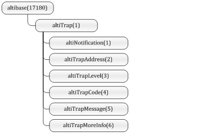

## 6. Traps

This chapter describes OIDs sent to the manager using traps when significant events occur in Altibase.

### altiTrap

altiTrap is a management information base (MIB) that shows the OIDs to be sent using traps. 



[Figure 6-1] altiTrap MIB

altiTrap MIB uses the trap altiTrap(1) under altibase(171780) to define the OIDs to be sent to the manager. These OIDs define information such as the port number, level, trap code, message, etc.

#### altiNotification MIB(1)

##### OID

1.3.6.1.4.1.17180.1.1

##### Syntax

```
OBJECT { altiTrapAddress, altiTrapLevel, altiTrapCode, altiTrapMessage,
altiTrapMoreInfo }
```

##### Description

altiNotification is an object type (notification) that contains 5 MIBs and is used to send a trap.

##### Example

```
# snmptrapd -f -P
2014-10-24 13:30:46 localhost [127.0.0.1]:
SNMPv2-MIB::sysUpTime.0 = Timeticks: (1017350) 2:49:33.50
SNMPv2-MIB::snmpTrapOID.0 = OID: SNMPv2-SMI::private
ALTIBASE-MIB::altiTrapAddress = STRING: 52473
ALTIBASE-MIB::altiTrapLevel = STRING: 3
ALTIBASE-MIB::altiTrapCode = STRING: 10000001
ALTIBASE-MIB::altiTrapMessage = STRING: Altibase is running.
ALTIBASE-MIB::altiTrapMoreInfo = STRING:
```

#### altiTrapAddress MIB(2)

##### OID

1.3.6.1.4.1.17180.1.2

##### Syntax

```
DisplayString
```

##### Description

altiTrapAddress displays the Altibase port number and is used to identify on which Altibase the trap was raised.

#### altiTrapLevel(3)

##### OID

1.3.6.1.4.1.17180.1.3

##### Syntax

```
DisplayString
```

##### Description

altiTrapLevel displays the trap priority. Each level means the following: 

1: This is a very important and urgent event.

2: This is a major event.

3: This is a common event.

#### altiTrapCode(4)

##### OID

1.3.6.1.4.1.17180.1.4

##### Syntax

```
DisplayString
```

##### Description

Codes are used to distinguish traps in Altibase. Trap codes are further discussed in [Trap Codes](#Trap Codes).

#### altiTrapMessage(5)

##### OID

1.3.6.1.4.1.17180.1.5

##### Syntax

```
DisplayString
```

##### Description

altiTrapMessage displays a description of the trap that was raised in Altibase.

#### altiTrapMoreInfo(6)

##### OID

1.3.6.1.4.1.17180.1.6

##### Syntax

```
DisplayString
```

##### Description

altiTrapMoreInfo displays additional information about traps raised in Altibase.

### Trade Codes

This section describes trap codes (altiTrapCode) and trap levels (altiTrapLevel) of Altibase. 

#### Altibase Running Status

##### Code

10000001

##### Level

3

##### Description

Altibase Running Status displays that Altibase is currently running.

##### Example

```
# snmptrapd -f -P
2014-10-24 13:30:46 localhost [127.0.0.1]:
SNMPv2-MIB::sysUpTime.0 = Timeticks: (1017350) 2:49:33.50
SNMPv2-MIB::snmpTrapOID.0 = OID: SNMPv2-SMI::private
ALTIBASE-MIB::altiTrapAddress = STRING: 52473
ALTIBASE-MIB::altiTrapLevel = STRING: 3
ALTIBASE-MIB::altiTrapCode = STRING: 10000001
ALTIBASE-MIB::altiTrapMessage = STRING: Altibase is running.
ALTIBASE-MIB::altiTrapMoreInfo = STRING:
```

#### Altibase UnRunning Status

##### Code

10000002

##### Level

3

##### Description

Altibase UnRunning Status displays that Altibase is currently not running.

##### Example

```
# snmptrapd -f -P

2014-10-24 13:33:38 localhost [127.0.0.1]:
SNMPv2-MIB::sysUpTime.0 = Timeticks: (1034562) 2:52:25.62
SNMPv2-MIB::snmpTrapOID.0 = OID: SNMPv2-SMI::private
ALTIBASE-MIB::altiTrapAddress = STRING: 52473
ALTIBASE-MIB::altiTrapLevel = STRING: 1
ALTIBASE-MIB::altiTrapCode = STRING: 10000002
ALTIBASE-MIB::altiTrapMessage = STRING: Altibase is not running.
ALTIBASE-MIB::altiTrapMoreInfo = STRING:
```

#### Altibase Subagent Running Status

##### Code

10000003

##### Level

3

##### Description

Altibase Subagent Running Status displays that Altibase’s subagent (altisnmpd) is running.

##### Example

```
# snmptrapd -f -P

2014-10-24 13:40:24 localhost [127.0.0.1]:
SNMPv2-MIB::sysUpTime.0 = Timeticks: (1075187) 2:59:11.87
SNMPv2-MIB::snmpTrapOID.0 = OID: SNMPv2-SMI::private
ALTIBASE-MIB::altiTrapAddress = STRING: 22082
ALTIBASE-MIB::altiTrapLevel = STRING: 3
ALTIBASE-MIB::altiTrapCode = STRING: 10000003
ALTIBASE-MIB::altiTrapMessage = STRING: Altisnmpd is running.
ALTIBASE-MIB::altiTrapMoreInfo = STRING: coldstart
```

#### Altibase Subagent UnRunning Status

##### Code

10000004

##### Level

3

##### Description

Altibase Subagent UnRunning Status displays that Altibase’s subagent (altisnmpd) is not running.

##### Example

```
# snmptrapd -f -P

2014-10-24 13:40:23 localhost [127.0.0.1]:
SNMPv2-MIB::sysUpTime.0 = Timeticks: (1075030) 2:59:10.30
SNMPv2-MIB::snmpTrapOID.0 = OID: SNMPv2-SMI::private
ALTIBASE-MIB::altiTrapAddress = STRING: 21947
ALTIBASE-MIB::altiTrapLevel = STRING: 1
ALTIBASE-MIB::altiTrapCode = STRING: 10000004
ALTIBASE-MIB::altiTrapMessage = STRING: Altisnmpd is not running.
ALTIBASE-MIB::altiTrapMoreInfo = STRING: nsNotifyShutdown
```

#### Session Query Timeout

##### Code

10000101

##### Level

2

##### Description

Session Query Timeout displays that altiPropertyAlarmQueryTimeout is 1 and a query timeout has occurred in an Altibase session.

##### Example

```
# snmptrapd -f -P

2014-10-24 14:00:01 localhost [127.0.0.1]:
SNMPv2-MIB::sysUpTime.0 = Timeticks: (1192924) 3:18:49.24
SNMPv2-MIB::snmpTrapOID.0 = OID: SNMPv2-SMI::private
ALTIBASE-MIB::altiTrapAddress = STRING: 52473
ALTIBASE-MIB::altiTrapLevel = STRING: 2
ALTIBASE-MIB::altiTrapCode = STRING: 10000101
ALTIBASE-MIB::altiTrapMessage = STRING: [Notify : Query Timeout] Session Closed by Server : Session ID = 2
ALTIBASE-MIB::altiTrapMoreInfo = STRING: Please check altibase_boot.log
```

#### Session Fetch Timeout

##### Code

10000102

##### Level

2

##### Description

Session Fetch Timeout displays that altiPropertyAlarmFetchTimeout is 1 and a fetch timeout has occurred in an Altibase session

##### Example

```
# snmptrapd -f -P

2014-10-24 14:00:01 localhost [127.0.0.1]:
SNMPv2-MIB::sysUpTime.0 = Timeticks: (1192924) 3:18:49.24
SNMPv2-MIB::snmpTrapOID.0 = OID: SNMPv2-SMI::private
ALTIBASE-MIB::altiTrapAddress = STRING: 52473
ALTIBASE-MIB::altiTrapLevel = STRING: 2
ALTIBASE-MIB::altiTrapCode = STRING: 10000102
ALTIBASE-MIB::altiTrapMessage = STRING: [Notify : Fetch Timeout] Session Closed by Server : Session ID = 2
ALTIBASE-MIB::altiTrapMoreInfo = STRING: Please check altibase_boot.log
```

#### Session Utrans Timeout

##### Code

10000103

##### Level

2

##### Description

Session Utrans Timeout displays that altiPropertyAlarmUtransTimeout is 1 and a utrans timeout has occurred in an Altibase session

##### Example

```
# snmptrapd -f -P

2014-10-24 14:12:01 localhost [127.0.0.1]:
SNMPv2-MIB::sysUpTime.0 = Timeticks: (1192924) 3:18:49.24
SNMPv2-MIB::snmpTrapOID.0 = OID: SNMPv2-SMI::private
ALTIBASE-MIB::altiTrapAddress = STRING: 52473
ALTIBASE-MIB::altiTrapLevel = STRING: 2
ALTIBASE-MIB::altiTrapCode = STRING: 10000103
ALTIBASE-MIB::altiTrapMessage = STRING: [Notify : Utrans Timeout] Session Closed by Server : Session ID = 2
ALTIBASE-MIB::altiTrapMoreInfo = STRING: Please check altibase_boot.log
```

#### Too Many Continuous Query Failure

##### Code

10000201

##### Level

2

##### Description

A trap raised when query execution continuously fails more than the number set in. 

##### Example

```
# snmptrapd -f -P

2014-10-24 14:12:01 localhost [127.0.0.1]:
SNMPv2-MIB::sysUpTime.0 = Timeticks: (1192924) 3:18:49.24
SNMPv2-MIB::snmpTrapOID.0 = OID: SNMPv2-SMI::private
ALTIBASE-MIB::altiTrapAddress = STRING: 52473
ALTIBASE-MIB::altiTrapLevel = STRING: 2
ALTIBASE-MIB::altiTrapCode = STRING: 10000103
ALTIBASE-MIB::altiTrapMessage = STRING: [Notify : Session Failure]  Session Failed Continuously : Session ID = 2, Count = 3
ALTIBASE-MIB::altiTrapMoreInfo = STRING: Please check altibase_boot.log 
```

